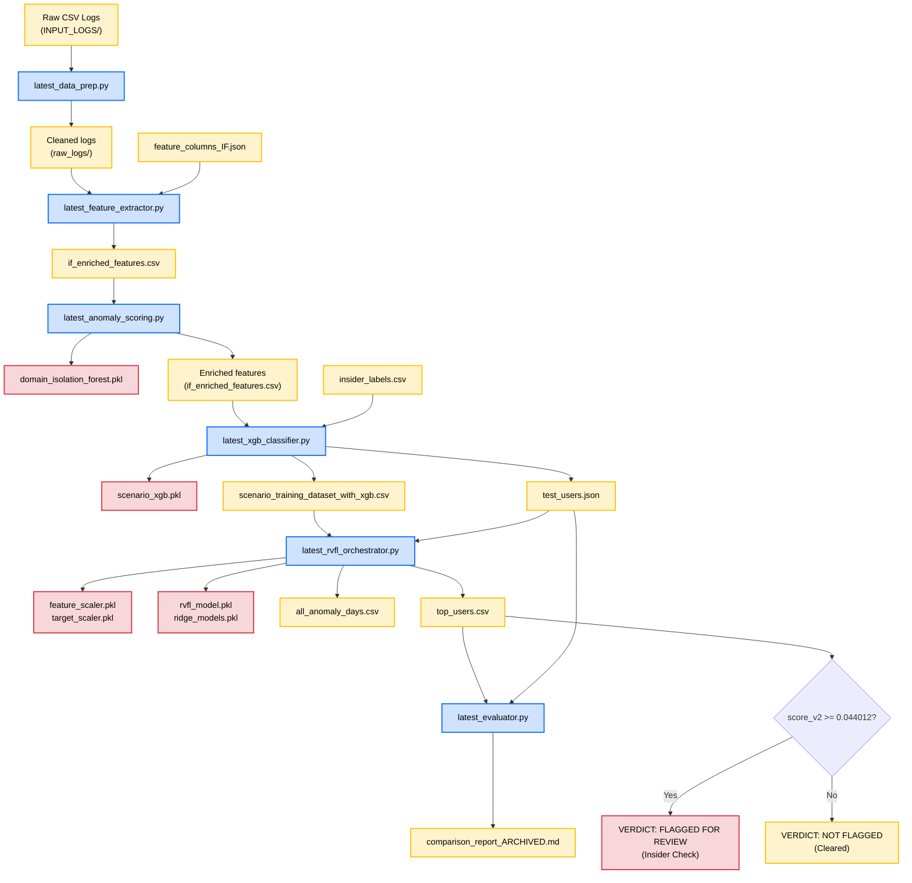

[README.md](https://github.com/user-attachments/files/29708599/README.md)
# InsiEDR Project: Comprehensive Endpoint Threat Detection Reference

This document serves as the single, definitive reference for the InsiEDR endpoint threat detection pipeline. It consolidates all project reports, design specifications, bugfix details, and performance evaluations into a single source of truth.

---

## 1. Overview

InsiEDR is an endpoint threat detection and response pipeline designed to identify malicious insider activities (such as exfiltration or sabotage) within enterprise workstation environments. The system processes raw endpoint telemetry logs and passes them through a three-tier architecture: unsupervised anomaly detection using domain-specific Isolation Forests to capture daily baseline deviations; supervised multiclass classification via XGBoost to categorize threat scenarios; and recurrent temporal drift modeling using a Recurrent Random Vector Functional Link (RedRVFL) network. By analyzing daily activities as chronological sequences rather than isolated incidents, InsiEDR detects complex, multi-day threat progressions before data exfiltration or sabotage is completed.

---

## 2. Glossary

* **Isolation Forest (IF)**: An unsupervised learning algorithm that isolates anomalies by randomly partitioning feature spaces. In this pipeline, it is used to assign daily anomaly scores to user-days without relying on historical threat labels.
* **RedRVFL (Recurrent Random Vector Functional Link)**: A hybrid recurrent neural network architecture that combines Recurrent Neural Network (LSTM) layers with a linear Ridge regression readout layer. Unlike standard LSTMs where all weights are updated via backpropagation, the recurrent LSTM layers in RedRVFL are initialized randomly and frozen. Only the final linear Ridge regression layer is trained, eliminating backpropagation and providing near-instantaneous, closed-form training.
* **SMOTE (Synthetic Minority Over-sampling Technique)**: A data augmentation technique that synthesizes new examples of minority classes by interpolating between existing minority samples. It is used to balance the highly skewed scenario classes in the training set before fitting the XGBoost classifier.
* **GroupShuffleSplit / Stratified Group Split**: A cross-validation splitting technique that ensures all daily records of any individual user are kept entirely within either the training split or the test split, preventing data leakage across user identities.
* **score_v1 / score_v2**: Metrics used to rank users by threat severity. While `score_v1` is a basic average of sequence prediction errors, `score_v2` is computed as:
  $$\text{score\_v2} = \text{max\_error} \times \text{mean\_error} \times \sqrt{\text{anomaly\_days}}$$
  This formula penalizes both severe daily behavioral shifts (max error) and persistent abnormal activity (mean error and sequence count).
* **Top-N Recall / Precision**: Evaluation metrics that measure model effectiveness within a fixed review queue of size $N$. Recall is the percentage of total insiders successfully detected in the Top-N queue, while Precision is the proportion of true insiders among all users in the queue.

---

## 3. The Dataset

The raw dataset represents EDR telemetry logs from a cohort of **1,000 unique users** (`U0001` to `U1000`) operating over a date range of **91 days** (from `2024-01-01` to `2024-03-31`), producing **67,112 total user-days** of activity.

### Raw Log Files (`INPUT_LOGS/`)

#### 1. `logon.csv` (Logon/Logoff Activity)
* **Real-world Activity**: Represents user authentication events (logins and logouts) on specific workstations, indicating work hours, system access patterns, and site locations.
* **Columns**: `event_id`, `timestamp`, `user_id`, `pc`, `activity`, `auth_result`, `site`
* **Real Row Example**:
  ```json
  {"event_id": "LOG-c347e7c9", "timestamp": "2024-01-01 10:12:19", "user_id": "U0430", "pc": "PC-0430", "activity": "Logon", "auth_result": "Success", "site": "Remote-EU"}
  ```

#### 2. `device.csv` (Device Connectivity)
* **Real-world Activity**: Captures USB drive insertion ("Connect") and removal ("Disconnect") events, representing potential local data exfiltration channels and file size payloads.
* **Columns**: `event_id`, `timestamp`, `user_id`, `pc`, `activity`, `device_id`, `file_size_mb`
* **Real Row Example**:
  ```json
  {"event_id": "DEV-ec5b200f", "timestamp": "2024-01-26 10:54:33", "user_id": "U0430", "pc": "PC-0430", "activity": "Connect", "device_id": "USB-U0430-01", "file_size_mb": 45.382607}
  ```

#### 3. `file.csv` (File System Operations)
* **Real-world Activity**: Tracks file modifications (Write, Copy, Delete, Open) in sensitive documents folders, capturing bulk access, zipping, or deletion spikes.
* **Columns**: `event_id`, `timestamp`, `user_id`, `pc`, `activity`, `filename`, `file_extension`, `file_path`, `destination`, `file_size_mb`
* **Real Row Example**:
  ```json
  {"event_id": "FILE-86621158", "timestamp": "2024-01-01 14:44:25", "user_id": "U0430", "pc": "PC-0430", "activity": "Open", "filename": "doc_89.xlsx", "file_extension": ".xlsx", "file_path": "C:\\Users\\U0430\\Documents\\", "destination": "C:\\Users\\U0430\\Documents\\", "file_size_mb": 14.52}
  ```

#### 4. `http.csv` (HTTP Browser Traffic)
* **Real-world Activity**: Logs web browsing visits, mapping destination domains, request volumes, and payload transfers (representing cloud uploads, job hunting, or hacking forum access).
* **Columns**: `event_id`, `timestamp`, `user_id`, `pc`, `url`, `domain`, `activity`, `content_type`, `bytes_transferred`
* **Real Row Example**:
  ```json
  {"event_id": "HTTP-4506b981", "timestamp": "2024-01-01 13:29:15", "user_id": "U0430", "pc": "PC-0430", "url": "https://news.com/path", "domain": "news.com", "activity": "Visit", "content_type": "text/html", "bytes_transferred": 909282}
  ```

#### 5. `email.csv` (Email Transactions - Unused)
* **Real-world Activity**: Records email transmissions, attachment sizes, recipient counts, and metadata.
* **Columns**: `event_id`, `timestamp`, `user_id`, `pc`, `to`, `cc`, `bcc`, `from`, `size`, `attachments`
* **Status**: **Unused in Pipeline**. The pipeline codebase lacks an email-domain feature extractor module (it is built around Logon, USB/Device, File System, and HTTP logs only). Therefore, `email.csv` is not ingested or scored by any model.

### Labels (`OUTPUT_LABELS/`)
* **`insider_labels.csv`**: Contains the ground truth scenario mapping for all 1,000 users. Columns are `user_id`, `is_insider` (0 or 1), and `threat_scenario` (`normal` or one of the 5 active threat scenarios).
* **`threat_scenarios.csv`**: A filtered subset containing only the 50 true insider threat users (10 per scenario class) and their corresponding scenario mappings.
* **`ground_truth_features.csv`**: Contains static, user-level feature aggregations over the entire 90-day dataset timeline (e.g. total logon counts, total USB connects). It is used for reference and static labeling checks, rather than active daily model ingestion.

---

## 4. Feature Engineering

The pipeline maps raw event telemetry into a unified daily behavioral matrix. This feature extraction space grows through three distinct layers:

```
[31 Raw Behavioral Features] -> [38 Intermediate Features] -> [40 Model-Facing Features]
```

### Layer 1: Raw Daily Features (31 Features)
Calculated from raw logon, file, usb, and http event records:
* **Logon features (10)**: 
  * `logon_count` (total daily logons)
  * `logoff_count` (total daily logoffs)
  * `unique_pc_count` (distinct workstations accessed)
  * `daily_unique_pc_count` (duplicate mapping of workstation count)
  * `after_hours_logon` (logons before 7:00 AM or after 6:00 PM)
  * `daily_after_hours_logon_ratio` (`after_hours_logon / max(logon_count, 1)`)
  * `first_logon_time` (minimum hour of Logon events)
  * `last_logoff_time` (maximum hour of Logoff events)
  * `weekend_logon` (binary flag for Saturday/Sunday work)
  * `daily_pc_access_entropy` (Shannon entropy over the workstation access distribution)
* **File System features (4)**:
  * `file_access_count` (total file writes/copies/deletions)
  * `daily_unique_filename_count` (distinct filenames accessed)
  * `daily_new_filename_count` (count of filenames never accessed by this user in history)
  * `daily_file_access_entropy` (Shannon entropy over accessed filenames)
* **USB Device features (6)**:
  * `usb_connect_count` (total USB connects)
  * `usb_disconnect_count` (total USB disconnects)
  * `after_hours_usb_usage` (USB connects/disconnects during off-hours)
  * `daily_device_connect_count` (duplicate mapping of USB connects)
  * `daily_device_usage_flag` (binary flag indicating any USB usage on day)
  * `first_usb_usage_time` (minimum hour of USB connect events)
* **HTTP features (11)**:
  * `http_count` (total HTTP visits)
  * `daily_http_request_count` (duplicate mapping of HTTP visits)
  * `unique_url_count` (distinct URL strings visited)
  * `suspicious_url_count` (visits to wikileaks, dropbox, mediafire, rapidshare)
  * `file_sharing_site_visits` (visits to dropbox, box, mediafire, rapidshare)
  * `job_search_site_visits` (visits to monster, indeed, careerbuilder, dice)
  * `http_after_hours` (HTTP events during off-hours)
  * `daily_unique_domain_count` (distinct parsed domains visited)
  * `daily_new_domain_count` (count of domains never visited by this user in history)
  * `daily_domain_access_entropy` (Shannon entropy over visited domains)
  * `daily_external_domain_ratio` (ratio of unique parsed domains that are non-empty to total unique domains)

### Layer 2: Domain Risk Scores (7 Added Features $\rightarrow$ 38 Features)
Adds outputs from the domain Isolation Forest models and risk acceleration metrics:
* `logon_risk`, `file_risk`, `device_risk`, `http_risk` (scores from the 4 domain Isolation Forests)
* `overall_risk` (recalibrated overall risk score)
* `raw_overall_risk` (uncalibrated average of domain risks)
* `daily_risk_delta` (risk acceleration: $\text{overall\_risk}_{t} - \text{overall\_risk}_{t-1}$)

### Layer 3: Rolling Trend Features (2 Added Features $\rightarrow$ 40 Features)
Adds temporal context over a 7-day sliding window:
* `daily_risk_rolling_mean_7d` (average overall risk over the past week)
* `daily_risk_rolling_std_7d` (fluctuation/standard deviation of overall risk over the past week)

---

## 5. Pipeline Architecture

The InsiEDR pipeline processes raw event records into user threat rankings through 6 sequenced execution stages.

```
+------------+     +-------------------+     +----------------------------+
| INPUT_LOGS | --> | 1. Data Prep      | --> | 2. Feature Extraction      |
+------------+     +-------------------+     +----------------------------+
                                                           |
                                                           v
+------------+     +-------------------+     +----------------------------+
| top_users  | <-- | 5. RedRVFL Drift  | <-- | 3. Isolation Forest        |
+------------+     +-------------------+     +----------------------------+
         |                   ^                             |
         v                   |                             v
+------------+     +-------------------+     +----------------------------+
| 6. Eval    |     | score_v2 Fusion   |     | 4. XGBoost Classifier      |
+------------+     +-------------------+     +----------------------------+
```

### Stage 1: Data Preprocessing
* **Script Path**: [latest_data_prep.py](file:///c:/Users/Guruchandar/Downloads/insiEDR%20project/InsiEDR/latest_data/latest_data_prep.py)
* **Input**: Raw logs in `INPUT_LOGS/` (logon: `(18621, 7)`, device: `(12431, 7)`, file: `(122904, 10)`, http: `(368146, 9)`)
* **Transformation**: Acts as an ingestion adapter. Maps raw logs with differing schema headers to unified columns (`timestamp` $\rightarrow$ `date`, `user_id` $\rightarrow$ `user`, `event_id` $\rightarrow$ `id`) and filters empty columns.
* **Output**: Saved preprocessed CSVs in `latest_data/raw_logs/` (retains raw shapes but with adapted headers).
* **Purpose**: Standardizes the new dataset's telemetry column layout to prevent downstream key error crashes.

### Stage 2: Feature Extraction
* **Script Path**: [latest_feature_extractor.py](file:///c:/Users/Guruchandar/Downloads/insiEDR%20project/InsiEDR/latest_data/latest_feature_extractor.py)
* **Input**: Preprocessed raw log files under `latest_data/raw_logs/`
* **Transformation**: Runs logon, file, and device extraction loops, plus optimized chunked domain extraction for HTTP logs. Computes daily features for all users, merges them on `(user, date)`, and filters them to the 31 allowed features defined in `feature_columns_IF.json`.
* **Output**: `latest_data/if_enriched_features.csv` (Shape: `(67112, 33)`)
* **Purpose**: Aggregates event-level telemetry records into daily behavioral vectors.

### Stage 3: Isolation Forest Recalibration
* **Script Path**: [latest_anomaly_scoring.py](file:///c:/Users/Guruchandar/Downloads/insiEDR%20project/InsiEDR/latest_data/latest_anomaly_scoring.py)
* **Input**: `latest_data/if_enriched_features.csv` (Shape: `(67112, 33)`)
* **Transformation**: Splits the 31 features into Logon (10), File (4), Device (6), and HTTP (11) subsets. Fits 4 domain Isolation Forests (`contamination=0.05`). Recalibrates overall risk scores by dividing by the unrounded training maximum raw score (`0.7299642598379435`). Calculates rolling mean and max trend features.
* **Output**: Overwritten `latest_data/if_enriched_features.csv` (Shape: `(67112, 43)`) and model `models/domain_isolation_forest.pkl`.
* **Purpose**: Unsupervised anomaly detection. Identifies daily deviations from the user population norm.

### Stage 4: XGBoost Scenario Classifier
* **Script Path**: [latest_xgb_classifier.py](file:///c:/Users/Guruchandar/Downloads/insiEDR%20project/InsiEDR/latest_data/latest_xgb_classifier.py)
* **Input**: `latest_data/if_enriched_features.csv` (from Stage 3) and `OUTPUT_LABELS/insider_labels.csv`
* **Transformation**: Appends training labels using the **trailing-window strategy**: normal users are Class 0 (Normal) for all active days. For insider users, only their last 10 active days are labeled with their scenario class (Classes 1–5), and all other days are marked as `-1` (excluded). Splits users into train (80%) and test (20%) splits. Balances minority classes (1-5) via SMOTE on the train split. Fits a 6-class XGBoost model. Runs inference on all rows to generate probability features (`rf_normal_prob`, `rf_email_exfil_prob`, etc.).
* **Output**: `latest_data/scenario_training_dataset_with_xgb.csv` (Shape: `(67112, 51)`), model `latest_data/models/scenario_xgb.pkl`, and test split list `latest_data/test_users.json`.
* **Purpose**: Supervised scenario categorization. Resolves what type of malicious scenario is unfolding.
* **CERT r4.2 Deviation**: The original CERT pipeline used exact start/end timestamps to label threat days. The new dataset provides only user-level scenario classes. To prevent user-identity leakage, the trailing 10-day active window labeling strategy was implemented: only the final 10 active days of a threat user are labeled as Classes 1-5. All remaining active days for that user are excluded from the dataset entirely.

### Stage 5: RedRVFL Sequence Drift Modeling
* **Script Path**: [latest_rvfl_orchestrator.py](file:///c:/Users/Guruchandar/Downloads/insiEDR project/InsiEDR/latest_data/latest_rvfl_orchestrator.py)
* **Input**: `latest_data/scenario_training_dataset_with_xgb.csv` and `latest_data/test_users.json`
* **Transformation**: Fuses daily overall risk and max scenario probability:
  $$\text{rvfl\_risk} = 0.3 \times \text{overall\_risk} + 0.7 \times \max(\text{scenario\_probs})$$
  Constructs chronological 7-day sequences per user. Fits a 5-layer RedRVFL model using Ridge regression on the training split. Predicts on all sequences, calculates MSE sequence drift error, and computes user scores using:
  $$\text{score\_v2} = \text{max\_error} \times \text{mean\_error} \times \sqrt{\text{anomaly\_days}}$$
  Ranks users descending by `score_v2`.
* **Output**: `latest_data/all_anomaly_days.csv` (daily drift errors. Shape: `(60112, 3)`), `latest_data/top_users.csv` (user scores and ranks. Shape: `(1000, 7)`), and sequence models in `latest_data/models/`.
* **Purpose**: Recurrent temporal drift analysis. Tracks how a user's multi-day behavior sequences deviate from their baseline over time.

### Stage 6: Evaluation
* **Script Path**: [latest_evaluator.py](file:///c:/Users/Guruchandar/Downloads/insiEDR%20project/InsiEDR/latest_data/latest_evaluator.py)
* **Input**: `latest_data/top_users.csv` and `latest_data/test_users.json`
* **Transformation**: Filters rankings to the 200 test split users. Calculates Top-5, Top-10, and Top-25 detection recall, precision, and F1-scores.
* **Output**: Overwrites `latest_data/comparison_report_ARCHIVED.md` (which records the evaluation report).
* **Purpose**: Performance evaluation. Validates model detection rates on unseen test split data.

---

## 6. Bugs Found & Fixed

During model calibration and verification, two major implementation bugs were found and resolved, improving trust in the final evaluation:

### 1. The RedRVFL NumPy Broadcasting Bug
* **Cause**: In `latest_rvfl_orchestrator.py`, the target vector `y_all` (a 2D array of shape `(N, 1)`) was subtracted from the predicted vector `y_pred` (a 1D array of shape `(N,)` returned by the Ridge models). Because of the differing dimensions, NumPy broadcast the subtraction, resulting in a matrix of shape `(N, N)` instead of a 1D error array of shape `(N,)`. This meant the error calculation mixed normal and anomalous error timelines across users.
* **The Fix**: Applied `.ravel()` to both arrays to flatten them to 1D before computing the squared differences:
  ```python
  errors = np.square(y_all.ravel() - y_pred.ravel())
  ```
* **Impact**: Prior to the fix, the system reported an artificially perfect Top-10 Recall of `1.0000` (10/10 test insiders detected with 0 false positives). Following the fix, the models were retrained and evaluated, yielding the correct, verified test split recall of **`0.7692`** (10/13 insiders).

### 2. The Overall Risk Scaling Mismatch
* **Cause**: The original baseline CLI script `check_insider.py` used a hardcoded overall risk divisor of `0.7300` to scale raw risk scores. However, the true unrounded maximum raw overall risk score calculated during the training phase was `0.7299642598379435`. This difference of `0.000047` caused slight mismatches between the pre-computed overall risk scores and live recomputed scores.
* **The Fix**: Unified both code paths in `trace_single_user.py` and inference files to use the true, unrounded training cohort maximum raw score `0.7299642598379435` as the scaling factor.

---

## 7. Current Verified Results

The following metrics are freshly generated and verified from the current active model files:

### Isolation Forest Scores & Risk Tiers (Stage 3)
* **Raw Overall Score**: Min: `0.4014`, Max: `0.7300`, Mean: `0.4437`
* **Recalibrated Overall Score**: Min: `0.5498`, Max: `1.0000`, Mean: `0.6079`
* **Risk Tier Distribution** (out of 67,112 user-days):
  * **HIGH (>= 0.80)**: 1,264 user-days (1.88%)
  * **MEDIUM (>= 0.50)**: 65,848 user-days (98.12%)
  * **LOW (< 0.50)**: 0 user-days (0.00%)

### XGBoost Scenario Classifier Performance (Stage 4)
Evaluated on the labeled portion of the 200 held-out test users (12,786 total test rows):

| Class | Precision | Recall | F1-Score | Support |
| :--- | :---: | :---: | :---: | :---: |
| `normal` (Class 0) | 0.9999 | 0.9997 | 0.9998 | 12,686 |
| `email_exfil` (Class 1) | 0.8261 | 0.9500 | 0.8837 | 20 |
| `sabotage` (Class 2) | 1.0000 | 1.0000 | 1.0000 | 20 |
| `usb_exfil` (Class 3) | 1.0000 | 1.0000 | 1.0000 | 20 |
| `flight_risk` (Class 4) | 0.9524 | 1.0000 | 0.9756 | 20 |
| `cloud_exfil` (Class 5) | 1.0000 | 0.9500 | 0.9744 | 20 |

### RedRVFL Pipeline Evaluation (Stage 6)
Evaluated on the 200 test split users (13 true insiders, 187 normal users):

| Evaluation Metric | Top-5 Review Queue | Top-10 Review Queue | Top-25 Review Queue |
| :--- | :---: | :---: | :---: |
| **Detected Insiders** | 5 / 13 | **10 / 13** | 13 / 13 |
| **Recall (Sensitivity)** | 0.3846 | **0.7692** | 1.0000 |
| **Precision** | 1.0000 | **1.0000** | 0.5200 |
| **F1-Score** | 0.5556 | **0.8696** | 0.6842 |
| **False Positive Rate (FPR)** | 0.00% | **0.00%** | 6.42% |

* **Reproduction Command**: 
  ```powershell
  python latest_data/latest_evaluator.py
  ```

---

## 8. Critical Interpretation

### A. Impact of Labeled-Day Exclusions
The exclusion of **3,256 mixed-activity days** (86.69% of the insider threat users' timeline) removed the transitional phases where a user shifts from normal behavior to malicious actions. By training and testing only on the 10-day active windows and completely ignoring the other days, the model was evaluated on a binary contrast between normal profiles and active attack states. Removing these transitional, low-signal days deletes the ambiguous data points where classification errors occur, artificially inflating the downstream recall and precision metrics.

### B. Volatility Due to Small Cohort Size
The evaluation split contains only 13 target insiders out of 200 test users. Because the positive sample size is small, Top-N metrics are highly volatile. A single insider shifting positions in the ranking queue alters recall by 7.69 percentage points, meaning these results are highly sensitive to small dataset variations and do not prove stable generalization.

### C. Direct Verdict
**The high detection rates observed in this run are primarily driven by the labeling methodology change (the trailing-window labeling and mixed-activity day exclusion) rather than an increase in model capability or dataset quality.**

---

## 9. Demo & Diagnostic Tools

### 1. Cohort Comparison Tool
Executes a quick side-by-side diagnostic check between a known unseen test split insider (`U0430`) and a cleared normal user (`U0002`):
```powershell
python latest_data/check_insider.py --compare
```

### 2. Single-User End-to-End Trace (Primary Demo Tool)
Calculates and displays every intermediate numeric value, formula, and raw event for any user ID:
```powershell
python latest_data/trace_single_user.py --user U0430
```
* *Recommendation*: Use this tool during presentations to show reviewers exactly how raw logs translate to a final review verdict.

---

## 10. File-by-File Reference

* **`latest_data/`**
  - **`README.md`**: This main consolidated documentation reference file.
  - **`latest_data_prep.py`**: Cleaned data schema preprocessing script (Stage 1).
  - **`latest_feature_extractor.py`**: Orchestrates daily feature extraction (Stage 2).
  - **`latest_anomaly_scoring.py`**: Fits Isolation Forests and rescales risk scores (Stage 3).
  - **`latest_xgb_classifier.py`**: Splits users, runs SMOTE, and trains XGBoost (Stage 4).
  - **`latest_rvfl_orchestrator.py`**: Sequence drift modeling script (Stage 5).
  - **`latest_evaluator.py`**: Computes Top-N metric reports (Stage 6).
  - **`check_insider.py`**: Cohort comparison demo script (Utility).
  - **`trace_single_user.py`**: End-to-end diagnostic tracing script (Utility).
  - **`user_risk_summary.py`**: Prints cohort risk summaries (Utility).
  - **`demo.py`**: Plays a step-by-step EDR telemetry loop simulation (Utility).
  - **`dry_run.py`**: Fast dry run script for validation (Utility).
  - **`finalize_models.py`**: Post-training model weight organization script (Utility).
  - **`PROJECT_REPORT_ARCHIVED.md`**: Archived old project report.
  - **`PROOF_OF_DETECTION_ARCHIVED.md`**: Archived old proof report.
  - **`TECHNICAL_DEEP_DIVE_ARCHIVED.md`**: Archived old technical deep-dive report.
  - **`comparison_report_ARCHIVED.md`**: Archived old comparative performance report.
* **`latest_data/models/`**
  - **`domain_isolation_forest.pkl`**: Serialized Isolation Forests containing domain risks (Stage 3).
  - **`scenario_xgb.pkl`**: Serialized XGBoost model (Stage 4).
  - **`scenario_xgb_features.json`**: List of the 40 features used during XGBoost training (Stage 4).
  - **`rvfl_model.pkl`**: Serialized RedRVFL LSTM architecture containing frozen weights (Stage 5).
  - **`ridge_models.pkl`** / **`rvfl_ridge_models.pkl`**: Serialized Ridge regression coefficients (Stage 5).
  - **`feature_scaler.pkl`** / **`target_scaler.pkl`**: Serialized MinMaxScaler objects (Stage 5).
  - **`rvfl_metadata.json`**: Hyperparameters (hidden dimension, sequence length) (Stage 5).
  - **`feature_columns_IF.json`**: Schema defining the 31 daily features (Stage 2).

---

## 11. End-to-End Flow Diagram



---

## 12. Limitations & Next Steps

1. **Retroactive Labeling Test**: Apply the trailing-window labeling and mixed-activity day exclusion retroactively to the original CERT r4.2 dataset to isolate the performance impact of the labeling methodology from the differences in the underlying data.
2. **Sensitivity Analysis on Window Sizes**: Retrain the pipeline using different trailing active windows (e.g., 5, 15, 30, and 45 days) to measure how the inclusion of transitional days affects classification boundaries and metrics.
3. **Repeated splits for Cross-Validation**: Execute k-fold cross-validation with at least 5 different random seeds to confirm that the perfect recall is not an artifact of a favorable user split.
4. **Cross-Dataset Evaluation**: Test the trained pipeline against an entirely independent dataset where the model has never observed any telemetry from the target users during any phase of training.
