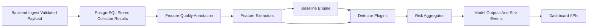
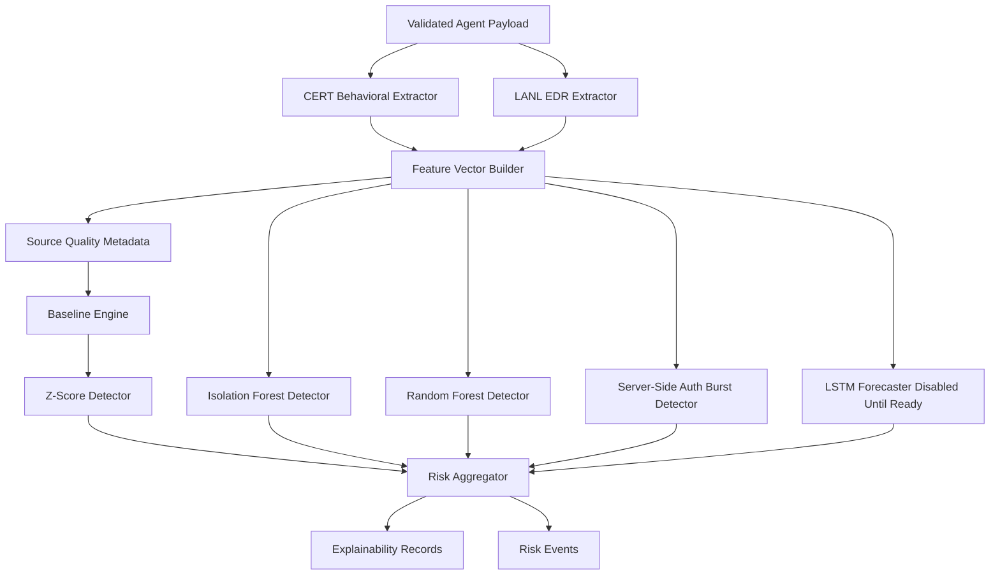

# Model Side Guide

## 1. Purpose

This guide is for the model-side employee responsible for backend feature extraction, baseline learning, detectors, risk aggregation, model evaluation, explainability, and model lifecycle.

The model side receives validated backend data. It does not run on the endpoint agent. It works only after the backend has received, decrypted, validated, and stored agent telemetry.

The endpoint agent sends feature telemetry only. It does not send anomaly decisions, alerts, threat scores, risk scores, baselines, detector outputs, or model outputs.

## 2. Source Of Truth From Completed Agent

This document is based on the actual completed agent files, not the older PDF terminology:

```text
agent/agent.py
agent/config.py
agent/payload_builder.py
agent/transport.py
agent/crypto/aesgcm.py
agent/collectors/base.py
agent/collectors/__init__.py
agent/collectors/logon.py
agent/collectors/file_feature.py
agent/collectors/devices_feature.py
agent/collectors/http_feature.py
agent/collectors/short-Term_EDR_Feature.py
agent/collectors/network_monitor.py
agent/collectors/computed_Meta-Features
shared/protocol.py
tests/test_agent_no_scoring_contract.py
tests/test_agent_collectors_no_db_coupling.py
tests/test_agent_network_monitor_contract.py
```

Important correction: older implementation notes may mention minifilter drivers, IRP hooks, USN Journal monitoring, HTTP monitoring, or removable-media byte transfer interception. Those are not what the current agent collector code implements.

## 3. Model-Side Boundary

The model side must not:

- Collect endpoint telemetry.
- Load or execute endpoint collector scripts directly in production.
- Handle agent HTTP transport.
- Handle agent local queue files.
- Decrypt payloads directly unless called through a backend-controlled crypto interface.
- Depend on raw endpoint execution state.
- Mutate agent payloads.

The model side must:

- Consume decrypted and validated telemetry from backend storage or backend service calls.
- Transform collector results into model-ready feature vectors.
- Preserve original collector feature names.
- Track feature quality and collector limitations.
- Learn per-user and per-agent baselines.
- Run detector plugins on backend/model infrastructure.
- Aggregate model outputs into explainable risk events.
- Provide results to backend storage and dashboard APIs.

## 4. Agent Implementation Accuracy Corrections

### File Monitoring Layer

Current implementation file:

```text
agent/collectors/file_feature.py
```

Actual technology used:

```text
watchdog
ReadDirectoryChangesW-style user-space filesystem observation
psutil removable-drive probing
path and filename heuristics
local state file for known filenames and previous access count
```

Not implemented in the current agent:

```text
Windows minifilter driver
IRP_MJ_CREATE monitoring
IRP_MJ_WRITE monitoring
IRP_MJ_SET_INFORMATION monitoring
USN Journal monitoring
true read/write pair reconstruction
kernel-level transfer byte accounting
```

Model-side impact:

- `file_copy_count` is heuristic-only. It is based on the same basename appearing in more than one location, not true paired read/write copy semantics.
- `external_drive_file_copy` means activity under a removable mount path. It does not prove source-to-destination copy direction.
- `large_file_transfer_count` is based on file size observed during activity, not actual transferred bytes.
- `unusual_file_access_ratio` is an agent-derived ratio using previous local activity count. Treat it as telemetry, not a detector result.

The model pipeline must treat these as behavioral indicators with quality caveats, not ground truth exfiltration events.

### USB Telemetry Layer

Current implementation file:

```text
agent/collectors/devices_feature.py
```

Actual technology used:

```text
Windows Event Logs
USB registry enumeration
device connect/disconnect event correlation
synthetic fallback data on non-Windows validation hosts
```

Not implemented in the current agent:

```text
minifilter removable-media write interception
IRP_MJ_WRITE byte tracking
true removable-media transfer reconstruction
```

Model-side impact:

- `usb_connect_count`, `usb_disconnect_count`, `usb_usage_duration`, `unique_usb_devices`, `daily_device_connect_count`, and `daily_device_usage_flag` are the reliable USB-oriented features.
- `usb_file_transfer_count` depends on `bytes_written > 0`, but `bytes_written` is not populated by the current collector path.
- `large_usb_transfer` depends on the same unpopulated byte field.

Model extractors should mark `usb_file_transfer_count` and `large_usb_transfer` as `VERIFY_REQUIRED` or low-confidence until real removable-media byte tracking exists.

### HTTP / Browser Telemetry Layer

Current implementation file:

```text
agent/collectors/http_feature.py
```

Actual technology used:

```text
Chrome History SQLite database
Edge History SQLite database
Firefox places.sqlite database
temporary safe copy of browser history databases
domain counting and local browser-history aggregation
```

Not implemented in the current agent:

```text
packet inspection
proxy-based HTTP capture
DNS capture
browser extension upload telemetry
non-browser network telemetry
incognito/private browsing visibility
malware or API traffic visibility
```

Model-side impact:

- `http_count`, `unique_url_count`, `download_count`, domain entropy, and daily domain counts are browser-history features.
- `upload_count` is explicitly set to `None` because local browser history does not reliably expose uploads.
- `suspicious_url_count`, `file_sharing_site_visits`, and `job_search_site_visits` are domain-list feature counts, not alerts.
- Do not treat missing HTTP history as proof of no web activity.

### Network Monitor Layer

Current implementation file:

```text
agent/collectors/network_monitor.py
```

Actual technology used:

```text
psutil network IO counters
psutil network interface stats
psutil inet connection metadata when available without elevated privileges
```

Not implemented:

```text
packet sniffing
deep packet inspection
threat feed lookup
destination classification
alert generation
admin-only capture
```

Model-side impact:

- `network-monitor` is an opt-in collector, not part of the default collector list.
- It returns passive local counters such as bytes, packets, interface counts, and connection counts.
- It should be used for context and health/behavioral modeling only.

### Authentication / Logon Layer

Current implementation files:

```text
agent/collectors/logon.py
agent/collectors/short-Term_EDR_Feature.py
```

The logon collector matches the intended source better than the other collectors:

```text
Windows Security Event Logs
Windows Event IDs
per-user logon/logoff/failure derivation
```

The short-term EDR collector now emits raw authentication window telemetry. Agent-side burst scoring was removed. The server/model side owns burst/deviation detection.

## 5. Data Handoff From Backend To Model Pipeline

After backend ingestion, the model pipeline should receive a validated payload with this shape:

```json
{
  "protocol_version": "2.0",
  "schema": "insiedr.agent.telemetry.v1",
  "payload_id": "uuid",
  "agent_id": "endpoint-agent-id",
  "hostname": "endpoint-host",
  "username": "endpoint-user",
  "os": {
    "system": "Windows",
    "release": "string",
    "version": "string",
    "machine": "string"
  },
  "collected_at": "2026-05-25T00:00:00Z",
  "collectors": [],
  "summary": {
    "collector_count": 6,
    "success_count": 5,
    "failed_count": 1
  }
}
```

Each collector result has this shape:

```json
{
  "collector": "collector-name",
  "collected_at": "2026-05-25T00:00:00Z",
  "hostname": "endpoint-host",
  "status": "success",
  "payload": {}
}
```

Failed collectors have `status == "failed"` and an `error` object. Failed collector rows should be used for collector health, missingness, and data-quality tracking. Do not fabricate feature values from failed collectors.

## 6. Required Model-Side Modules And Responsibilities

Use this Phase 2 target structure:

```text
server/
├── features/
│   ├── __init__.py
│   ├── base.py
│   ├── cert_behavioral.py
│   └── lanl_edr.py
├── baseline/
│   ├── __init__.py
│   └── engine.py
├── detectors/
│   ├── __init__.py
│   ├── base.py
│   ├── zscore_detector.py
│   ├── random_forest_detector.py
│   ├── isolation_forest_detector.py
│   ├── auth_burst_detector.py
│   └── lstm_forecaster.py
└── risk/
    ├── __init__.py
    └── aggregator.py
```

### `server/features/base.py`

- Define the feature extractor interface.
- Accept validated backend payloads or stored collector rows.
- Return stable feature dictionaries and ordered feature arrays.
- Preserve original feature names.
- Carry feature quality metadata.

### `server/features/cert_behavioral.py`

- Extract long-term behavioral features from:
  - `logon`
  - `file-feature`
  - `devices-feature`
  - `http-feature`
  - optional `network-monitor`
- Normalize per user, per agent, and per collection window.
- Apply source-quality flags for heuristic or unsupported features.

### `server/features/lanl_edr.py`

- Extract short-term authentication-window features from:
  - `short-term-edr`
- Preserve raw EDR feature names from the agent collector payload.
- Compute server-side auth burst/deviation signals only after backend storage and baseline context exist.

### `server/baseline/engine.py`

- Maintain per-user and per-agent baselines.
- Provide rolling windows and baseline-vs-current comparisons.
- Handle cold starts and missing features.
- Save baseline snapshots for dashboard and explainability.

### `server/detectors/base.py`

- Define common detector input and output contracts.
- Include detector name, model version, score, confidence, top features, reason summary, and timestamp.

### `server/detectors/auth_burst_detector.py`

- Compute burst/deviation behavior on the server side.
- Consume raw short-term EDR count/rate features.
- Do not expect `edr_auth_burst_score` from the agent.

## 7. Feature Engineering Contract

### Input

Input should be validated backend telemetry, not encrypted envelopes.

Required top-level fields from the agent payload:

```text
protocol_version
schema
payload_id
agent_id
hostname
username
os
collected_at
collectors
summary
```

### Collector Names

Default completed agent collector names:

```text
short-term-edr
computed-meta-features
devices-feature
file-feature
http-feature
logon
```

Optional collector:

```text
network-monitor
```

### Preserve Feature Names

Do not rename agent-derived feature names in storage or model metadata. If model arrays need canonical ordering, maintain a feature map that references the original names.

### Logon Feature Examples

```text
logon_count
logoff_count
after_hours_logon
weekend_logon
unique_pc_count
session_duration_avg
session_duration_max
remote_logon_count
daily_failed_login_ratio
daily_after_hours_logon_ratio
daily_logon_count
daily_new_pc_count
daily_pc_access_entropy
daily_unique_pc_count
```

The `logon` collector returns a dictionary keyed by user. Each value is a feature dictionary.

Recommended flattening:

```text
collector = logon
entity_user = key from logon payload
feature_name = original field name
feature_value = value from nested dictionary
```

### File Feature Examples

```text
file_access_count
file_open_count
file_copy_count
file_write_count
file_delete_count
sensitive_file_access
external_drive_file_copy
file_access_after_hours
large_file_transfer_count
unusual_file_access_ratio
daily_files_to_removable_count
daily_removable_media_flag
daily_file_access_entropy
daily_unique_filename_count
daily_new_filename_count
daily_file_open_count
daily_file_write_count
daily_file_delete_count
```

Quality notes:

- `file_copy_count` is heuristic-only.
- `external_drive_file_copy` is removable-path activity, not proven copy direction.
- `large_file_transfer_count` is based on file size, not transfer byte accounting.

### USB Feature Examples

```text
usb_connect_count
usb_disconnect_count
usb_usage_duration
usb_file_transfer_count
large_usb_transfer
first_usb_usage_time
after_hours_usb_usage
unique_usb_devices
daily_device_connect_count
daily_device_usage_flag
```

Quality notes:

- `usb_file_transfer_count` is currently not operationally reliable because `bytes_written` is not populated.
- `large_usb_transfer` is currently not operationally reliable for the same reason.

### HTTP / Browser Feature Examples

```text
http_count
unique_url_count
suspicious_url_count
file_sharing_site_visits
job_search_site_visits
download_count
upload_count
http_after_hours
daily_external_domain_ratio
daily_domain_access_entropy
daily_http_request_count
daily_unique_domain_count
daily_new_domain_count
```

Quality notes:

- These are browser-history features, not full HTTP/network telemetry.
- `upload_count` is expected to be `null`.
- Incognito browsing, non-browser app traffic, DNS traffic, and API/malware traffic are not covered.

### Short-Term EDR Feature Examples

```text
edr_auth_event_count_window
edr_success_auth_count_window
edr_failed_auth_count_window
edr_failed_auth_ratio_window
edr_unique_destination_computers_window
edr_unique_destination_users_window
edr_source_destination_pair_count_window
edr_unique_source_computers_per_user_window
edr_off_hours_auth_flag_window
edr_weekend_auth_flag_window
edr_auth_event_count_lookback
edr_auth_events_per_minute_window
edr_success_auth_events_per_minute_window
edr_failed_auth_events_per_minute_window
edr_unique_authentication_type_count_window
edr_unique_logon_type_count_window
```

Correction:

```text
edr_auth_burst_score
```

must not be expected from the agent. Burst scoring belongs in `server/detectors/auth_burst_detector.py`.

### Network Monitor Feature Examples

```text
network_interface_count
network_interfaces_up_count
network_bytes_sent
network_bytes_recv
network_packets_sent
network_packets_recv
network_errors_in
network_errors_out
network_dropin
network_dropout
network_active_connection_count
network_established_connection_count
network_listening_connection_count
network_loopback_connection_count
network_unique_remote_address_count
network_interfaces
```

Quality notes:

- Passive psutil counters only.
- No packet content.
- No threat feed or destination classification.
- May have fewer connection details when OS permissions restrict access.

### Missing Value Handling

Rules:

- Missing collector result: add missingness indicator and do not fabricate feature values.
- Failed collector: store error and mark feature group unavailable for that payload.
- Missing numeric feature inside successful collector: use null in storage; impute only inside model pipeline with explicit metadata.
- Unsupported local feature such as `upload_count` may be null.
- Features marked low-confidence or `VERIFY_REQUIRED` should remain available but should be down-weighted or excluded until validated.

### Timestamp Normalization

Normalize all timestamps to UTC:

```text
payload.collected_at
collector.collected_at
collector.payload.collected_at
collector.payload.collected_at_utc
collector.payload.first_*_time
collector.payload.last_*_time
```

If a timestamp lacks timezone information, treat it as endpoint local time only if backend has a trusted agent timezone. Otherwise mark `VERIFY_REQUIRED`.

`VERIFY_REQUIRED`: Agent payload does not include endpoint timezone. Model pipeline must define how to interpret naive timestamps from collector payloads.

### Computed Meta Features

The `computed-meta-features` collector intentionally returns server-deferred items:

```json
{
  "status": "server_deferred",
  "server_deferred_features": [
    "daily_files_to_removable_7d_sum",
    "daily_risk_delta",
    "daily_risk_rolling_mean_7d",
    "daily_risk_rolling_std_7d"
  ]
}
```

These are model/server-side responsibilities. The endpoint agent does not compute them.

## 8. Baseline Learning Requirements

Maintain baselines by:

```text
user
agent_id
user + agent_id
feature_name
collector
time bucket
```

Recommended windows:

```text
short-term: auth windows from short-term-edr payloads
daily: daily feature values
7-day: rolling sums/means/stddevs for server-deferred features
30-day or longer: stable behavioral baseline
```

Rules:

- Update baselines only after payload validation and storage.
- Track sample counts per feature.
- Track missingness separately.
- Persist baseline snapshots after updates.
- Version baseline logic.
- Do not update stable baselines with confirmed malicious activity unless using a separate reviewed process.

Cold start:

- Do not produce high-confidence anomaly decisions until enough history exists.
- Use population or role baselines only if available and explicitly labeled.
- Return lower confidence when baseline sample count is low.

## 9. Detector Responsibilities

### Common Detector Input

```json
{
  "payload_id": "uuid",
  "agent_id": "agent",
  "username": "user",
  "hostname": "host",
  "collected_at": "timestamp",
  "features": {
    "feature_name": 1.0
  },
  "feature_quality": {
    "feature_name": "heuristic"
  },
  "baseline": {
    "feature_name": {
      "mean": 0.5,
      "std": 0.1,
      "sample_count": 50
    }
  },
  "context": {
    "collector_status": {},
    "missing_features": [],
    "time_bucket": "daily"
  }
}
```

### Common Detector Output

```json
{
  "detector_name": "zscore_detector",
  "model_version": "version",
  "payload_id": "uuid",
  "agent_id": "agent",
  "username": "user",
  "timestamp": "timestamp",
  "is_anomaly": true,
  "score": 0.82,
  "confidence": 0.76,
  "feature_contributions": [
    {
      "feature_name": "daily_failed_login_ratio",
      "current_value": 0.4,
      "baseline_value": 0.02,
      "contribution": 0.51
    }
  ],
  "reason_summary": "Failed login ratio is elevated versus user baseline."
}
```

### Z-Score Detector

- Compare current features against learned baseline mean and variance.
- Use learned baseline state and calibrated sensitivity.
- Avoid hard-coded one-size-fits-all cutoffs.

### Auth Burst Detector

- Compute burst/deviation behavior on the server side.
- Consume raw auth window features such as:
  - `edr_auth_event_count_window`
  - `edr_failed_auth_ratio_window`
  - `edr_auth_events_per_minute_window`
  - `edr_failed_auth_events_per_minute_window`
  - `edr_unique_logon_type_count_window`
- Do not depend on an agent-provided burst score.

### Isolation Forest Detector

- Detect unusual multivariate feature vectors.
- Requires training or periodic fitting on historical clean feature vectors.
- Requires stable feature ordering and artifact versioning.

### Random Forest Detector

- Supervised detector when labeled data exists.
- Requires training labels, feature schema version, artifact storage, and calibration.

`VERIFY_REQUIRED`: No trained model artifact paths or labels are defined by the completed agent.

### LSTM Forecaster

- Future/advanced time-series forecaster.
- Requires sequential feature history, training pipeline, drift monitoring, and artifact lifecycle.
- Should remain disabled until enough data and evaluation exist.

## 10. Risk Aggregation

Risk aggregation combines detector results into backend-facing risk events.

One anomaly should not automatically become a high-risk alert because:

- A single collector may fail or be missing.
- A single detector may be noisy.
- Cold-start baselines are less reliable.
- Some features are only partial local observations.
- Insider threat risk depends on correlation across behavior, time, user, and host.

Aggregator should consider:

- Detector agreement.
- Detector confidence.
- Baseline stability.
- Feature source quality.
- Feature group correlation.
- Repeated deviations over time.
- User and agent history.
- Collector health.

Recommended risk event output:

```json
{
  "payload_id": "uuid",
  "agent_id": "agent",
  "username": "user",
  "hostname": "host",
  "timestamp": "timestamp",
  "risk_score": 72.5,
  "risk_level": "high",
  "detectors_triggered": ["zscore_detector", "auth_burst_detector"],
  "agreement_ratio": 0.5,
  "top_features": [],
  "correlated_signals": [],
  "reason_summary": "Multiple authentication and after-hours features deviated from baseline."
}
```

`VERIFY_REQUIRED`: Exact risk score scale and risk level labels are not defined by the completed agent.

## 11. Evaluation Plan

Track:

```text
precision
recall
F1 score
false positive rate
detection latency
baseline stability
feature missingness rate
collector failure rate
```

Evaluation must account for feature limitations:

- File copy features are heuristic.
- USB transfer byte features are not operationally implemented.
- HTTP telemetry is browser-history only.
- Network telemetry is passive counter metadata only.
- Upload telemetry is null unless a future collector source is added.

## 12. Model Testing Plan

- Unit test feature flattening and original-name preservation.
- Unit test timestamp normalization.
- Unit test missing value handling.
- Unit test feature quality flags.
- Unit test per-user logon payload flattening.
- Unit test CERT behavioral extraction for logon/file/device/http/network.
- Unit test LANL EDR extraction for raw auth window features.
- Unit test baseline cold start and rolling updates.
- Unit test each detector with calibrated sample data.
- Unit test risk aggregation with source-quality metadata.
- Integration test with stored backend payloads generated from the actual agent payload shape.

## 13. Model Acceptance Criteria

- [ ] Feature extractors consume validated backend payloads and stored collector rows.
- [ ] Original agent collector feature names are preserved.
- [ ] Feature quality limitations are stored with feature vectors.
- [ ] Missing and failed collector data is handled explicitly.
- [ ] USB byte-transfer features are marked `VERIFY_REQUIRED` or excluded until validated.
- [ ] HTTP upload count is treated as null/unsupported.
- [ ] Auth burst detection is computed server-side, not expected from the agent.
- [ ] Baselines are maintained per user and per agent.
- [ ] Cold-start behavior is implemented.
- [ ] Detector outputs share one documented result contract.
- [ ] Risk aggregation combines detector agreement, confidence, and source quality.
- [ ] Explainability data is stored and API-ready.
- [ ] Evaluation metrics are produced and reviewed.
- [ ] Integration tests pass with backend-ingested agent payloads.

## 14. Model Employee Workflow

1. Complete `server/features/base.py`.
   - Test interface, original feature names, and source-quality metadata.

2. Complete `server/features/cert_behavioral.py`.
   - Test logon, file, device, HTTP, and optional network extraction.

3. Complete `server/features/lanl_edr.py`.
   - Test raw short-term EDR feature extraction.

4. Complete `server/baseline/engine.py`.
   - Test cold start, update, rolling windows, and snapshots.

5. Complete `server/detectors/base.py`.
   - Test common detector result format.

6. Implement `zscore_detector.py`.
   - Test learned-baseline deviation output.

7. Implement `auth_burst_detector.py`.
   - Test server-side auth burst computation from raw auth rate/count features.

8. Implement `isolation_forest_detector.py`.
   - Test artifact loading, feature order, and scoring.

9. Implement `random_forest_detector.py`.
   - Test artifact loading and prediction.

10. Stub or gate `lstm_forecaster.py`.
    - Test disabled state until sequence data is ready.

11. Complete `server/risk/aggregator.py`.
    - Test aggregation, confidence, source quality, and explainability.

12. Add integration tests with backend payload storage.
    - Test full model pipeline after ingestion.

## 15. Mermaid Diagrams

### Backend-To-Model Data Flow



### Model Pipeline Architecture



## 16. VERIFY_REQUIRED Items

- `VERIFY_REQUIRED`: Endpoint timezone is not included in the agent payload. Define naive timestamp interpretation.
- `VERIFY_REQUIRED`: Exact baseline window sizes are not defined by agent code.
- `VERIFY_REQUIRED`: Model artifact paths, labels, and versioning policy are not defined by agent code.
- `VERIFY_REQUIRED`: Exact risk score scale and risk level labels are not defined by the completed agent.
- `VERIFY_REQUIRED`: Production detector calibration thresholds must come from validation data, not hard-coded assumptions.
- `VERIFY_REQUIRED`: `usb_file_transfer_count` and `large_usb_transfer` are not operationally reliable until `bytes_written` is populated by real transfer telemetry.
- `VERIFY_REQUIRED`: `upload_count` is expected to be null until a future upload-capable telemetry source exists.
- `VERIFY_REQUIRED`: File copy and removable copy features are heuristic, not kernel-level copy reconstruction.
- `VERIFY_REQUIRED`: HTTP telemetry is browser-history only, not full HTTP/network monitoring.
- `VERIFY_REQUIRED`: `network-monitor` is passive and opt-in; decide whether production deployments should enable it.
