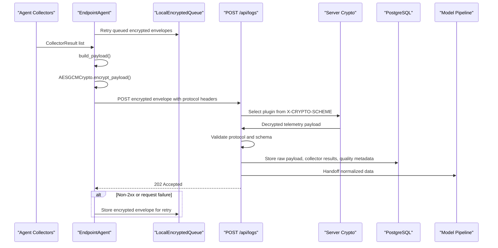
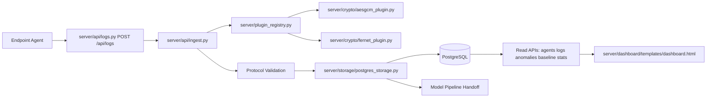

# Backend Server Guide

## 1. Purpose

This guide is for the backend-side employee responsible for server APIs, ingestion, decryption, validation, storage, dashboard services, operational APIs, and handoff into the model pipeline.

The endpoint agent is feature-only. It collects endpoint telemetry features, normalizes collector output, encrypts the protocol payload with AES-GCM, sends the encrypted envelope to the server, and queues failed encrypted envelopes locally for retry.

The backend is responsible for:

- Receiving encrypted telemetry from agents.
- Authenticating requests when bearer tokens or agent registration are configured.
- Decrypting AES-GCM envelopes.
- Validating decrypted payloads against `shared/protocol.py`.
- Persisting raw encrypted envelopes, decrypted metadata, collector results, normalized features, model outputs, risk events, and agent health.
- Calling model-side feature extraction only after successful ingestion and storage.
- Serving APIs for logs, agents, anomalies, baselines, stats, health, and dashboard data.

The backend must not:

- Collect endpoint telemetry directly.
- Assume the agent performed detection, alerting, baseline learning, or scoring.
- Treat a failed collector result as an invalid request when the encrypted payload itself is valid.
- Log raw encryption keys, bearer tokens, plaintext payload bodies, full ciphertexts, or sensitive collector values.
- Depend on the agent local queue. Queueing is agent-side only.

## 2. Current Backend Implementation Status

The repository currently contains the server-side folder structure, but the backend implementation files are placeholders.

Current inspected status:

```text
server/app.py                                      0 bytes
server/config.py                                   0 bytes
server/plugin_registry.py                          0 bytes
server/api/*.py                                    0 bytes
server/storage/postgres_storage.py                 0 bytes
server/storage/migrations/001_initial_schema.sql   0 bytes
server/crypto/*.py                                 0 bytes
server/features/*.py                               0 bytes
server/baseline/engine.py                          0 bytes
server/detectors/*.py                              0 bytes
server/risk/aggregator.py                          0 bytes
server/dashboard/templates/dashboard.html          0 bytes
```

This guide is therefore an implementation guide for completing the backend, not a claim that backend behavior already exists.

## 3. Source Of Truth From Completed Agent

The backend contract must follow these completed agent/shared files:

```text
agent/agent.py
agent/config.py
agent/payload_builder.py
agent/transport.py
agent/crypto/aesgcm.py
agent/crypto/fernet_compat.py
agent/queue/local_queue.py
agent/collectors/base.py
agent/collectors/__init__.py
agent/collectors/logon.py
agent/collectors/file_feature.py
agent/collectors/devices_feature.py
agent/collectors/http_feature.py
agent/collectors/short-Term_EDR_Feature.py
agent/collectors/network_monitor.py
agent/collectors/computed_Meta-Features
shared/protocol.py
shared/crypto_utils.py
tests/test_agent_https_ingest_integration.py
tests/test_agent_transport_hardening.py
tests/test_agent_log_safety.py
tests/test_agent_no_scoring_contract.py
tests/test_agent_collectors_no_db_coupling.py
```

Do not use older PDF collector names or older capability claims if they conflict with these files.

## 4. Agent-To-Server Connection Flow

### Endpoint

The agent default ingest URL from `agent/config.py` is:

```text
https://localhost:5000/api/logs
```

The backend must implement:

```text
POST /api/logs
```

`server/api/ingest.py` may contain the shared ingest service, but `server/api/logs.py` must expose the route expected by the agent.

`VERIFY_REQUIRED`: Decide whether production also exposes `POST /api/ingest` as an alias. The completed agent default points to `/api/logs`.

### HTTP Method

```text
POST
```

### Request Headers

The agent builds protocol headers through `shared.protocol.encrypted_payload_headers()` and then `agent/transport.py` adds Authorization only when an agent token is configured.

Expected request headers:

```text
Content-Type: application/json
X-CRYPTO-SCHEME: aes-256-gcm
X-PROTOCOL-VERSION: 2.0
X-AGENT-ID: <agent_id>
X-PAYLOAD-ID: <payload_id>
X-KEY-ID: <key_id>       # present for AES-GCM envelopes
Authorization: Bearer <token>   # present only when INSIEDR_AGENT_TOKEN or AGENT_TOKEN is configured
```

Important queue behavior:

- Authorization headers are sent on live requests from configured token state.
- Authorization headers are stripped before queue storage.
- Queued retry requests therefore rely on current configured token injection, not token material saved in queue files.

### TLS And Timeout

Agent behavior:

```text
INSIEDR_REQUEST_TIMEOUT_SECONDS default: 10
verify_tls default: True
```

For tests, `verify_tls` can be a CA/certificate path. Production should keep TLS verification enabled and use valid certificates.

Backend ingestion should respond quickly after durable persistence. Heavy model processing should happen asynchronously or after a clear accepted handoff.

### Request Body

The server receives an encrypted envelope, not plaintext telemetry.

AES-GCM envelope shape from `agent/crypto/aesgcm.py` and `agent/agent.py`:

```json
{
  "protocol_version": "2.0",
  "scheme": "aes-256-gcm",
  "key_id": "sha256-key-fingerprint-prefix",
  "nonce": "base64url-encoded-12-byte-nonce",
  "ciphertext": "base64url-encoded-ciphertext-plus-gcm-tag",
  "created_at": "2026-05-25T00:00:00Z",
  "payload_id": "uuid"
}
```

Security note:

- `nonce`, `ciphertext`, and the AES-GCM AAD authenticate the encrypted plaintext.
- `payload_id` and `created_at` in the outer envelope are outside the ciphertext.
- The decrypted plaintext also contains `payload_id`; the backend must verify header, envelope, and decrypted payload IDs match.

### Response Body

The completed agent does not parse the response body. In `agent/transport.py`, any HTTP `2xx` status is success.

Minimum valid success response:

```text
HTTP 204 No Content
```

Recommended JSON response:

```json
{
  "ok": true,
  "payload_id": "uuid",
  "status": "accepted"
}
```

`VERIFY_REQUIRED`: Freeze the success response body once dashboard/CLI/future-agent consumers exist. The current agent only requires a `2xx`.

### Agent Retry And Queue Behavior

If the server returns non-2xx or the request raises a `requests.RequestException`, the agent writes the already encrypted envelope to `LocalEncryptedQueue`.

Queue facts from `agent/queue/local_queue.py`:

- Queue is file-backed, not SQLite.
- Queue files use `.json`.
- Queue directory attempts POSIX mode `0o700`.
- Queue files attempt POSIX mode `0o600`.
- Queue files contain `created_at`, `payload_id`, sanitized `headers`, and `envelope`.
- Authorization headers are not stored.
- Corrupt, expired, oversized, and permanently failed queue files are moved to `dead_letter/`.
- The agent retries queued payloads before sending new telemetry.
- Retry limit defaults to `25` via `INSIEDR_QUEUE_RETRY_LIMIT`.
- Retry stops on the first retained failed item.

Backend implication: ingestion must be idempotent by `payload_id`.

## 5. End-To-End Data Flow

```text
Collector output
  -> CollectorResult wrapper
  -> build_payload()
  -> validate_telemetry_payload()
  -> AESGCMCrypto.encrypt_payload()
  -> TelemetryTransport.send_or_queue()
  -> POST /api/logs
  -> backend validates headers and envelope
  -> backend decrypts AES-GCM envelope
  -> backend validates plaintext telemetry
  -> backend stores encrypted/raw/decrypted metadata
  -> backend stores collector results and errors
  -> backend normalizes feature rows with source-quality metadata
  -> model pipeline extracts features and produces outputs
  -> risk aggregation persists risk events
  -> dashboard/API reads stored state
```

## 6. Decrypted Payload Shape

After AES-GCM decryption, the plaintext payload built by `agent/payload_builder.py` has this shape:

```json
{
  "protocol_version": "2.0",
  "schema": "insiedr.agent.telemetry.v1",
  "payload_id": "uuid",
  "agent_id": "endpoint-agent-id",
  "hostname": "endpoint-host",
  "username": "endpoint-user",
  "os": {
    "system": "Windows",
    "release": "string",
    "version": "string",
    "machine": "string"
  },
  "collected_at": "2026-05-25T00:00:00Z",
  "collectors": [
    {
      "collector": "logon",
      "collected_at": "2026-05-25T00:00:00Z",
      "hostname": "endpoint-host",
      "status": "success",
      "payload": {}
    }
  ],
  "summary": {
    "collector_count": 6,
    "success_count": 5,
    "failed_count": 1
  }
}
```

Failed collector result shape:

```json
{
  "collector": "http-feature",
  "collected_at": "2026-05-25T00:00:00Z",
  "hostname": "endpoint-host",
  "status": "failed",
  "error": {
    "type": "RuntimeError",
    "message": "short error summary"
  }
}
```

The server must store failed collector status and continue processing successful collector outputs.

## 7. Collector Capability Corrections For Backend Storage

The backend must not overstate collector semantics in database fields, APIs, or dashboard labels.

### File Features

Actual source:

```text
watchdog / user-space file observation
path and filename heuristics
psutil removable mount probing
```

Backend implication:

- `file_copy_count` is heuristic-only.
- `external_drive_file_copy` means removable-path activity, not proven copy direction.
- `large_file_transfer_count` is based on observed file size, not transfer byte accounting.

### USB Features

Actual source:

```text
Windows Event Logs
USB registry enumeration
connect/disconnect correlation
```

Backend implication:

- `usb_connect_count`, `usb_disconnect_count`, `usb_usage_duration`, and `unique_usb_devices` are useful device-behavior features.
- `usb_file_transfer_count` and `large_usb_transfer` depend on `bytes_written`, which is not populated by the current collector path.
- Store those features with `VERIFY_REQUIRED` or low-confidence quality metadata until real byte-transfer telemetry exists.

### HTTP Features

Actual source:

```text
Chrome/Edge/Firefox browser history SQLite databases
```

Backend implication:

- HTTP fields are browser-history features, not full network/HTTP monitoring.
- `upload_count` is expected to be `null`.
- Incognito/private browsing, DNS, non-browser app traffic, API traffic, and malware traffic are not covered.

### Short-Term EDR Features

Actual source:

```text
Windows Security Event Log authentication events
raw auth counts, ratios, and per-minute rates
```

Backend implication:

- Do not expect `edr_auth_burst_score` from the agent.
- Auth burst/deviation detection belongs in `server/detectors/auth_burst_detector.py`.

### Network Monitor

Actual source:

```text
psutil passive counters and inet connection metadata
```

Backend implication:

- `network-monitor` is optional/opt-in.
- It does not sniff packets, classify destinations, use threat feeds, or generate alerts.

## 8. Required Backend Modules And Responsibilities

Target structure:

```text
server/
├── app.py
├── config.py
├── plugin_registry.py
├── api/
│   ├── __init__.py
│   ├── ingest.py
│   ├── agents.py
│   ├── logs.py
│   ├── anomalies.py
│   ├── baseline.py
│   ├── stats.py
│   └── health.py
├── storage/
│   ├── __init__.py
│   ├── base.py
│   ├── postgres_storage.py
│   └── migrations/
│       └── 001_initial_schema.sql
├── crypto/
│   ├── __init__.py
│   ├── base.py
│   ├── aesgcm_plugin.py
│   ├── fernet_plugin.py
│   └── plaintext_plugin.py
└── dashboard/
    └── templates/
        └── dashboard.html
```

### `server/app.py`

- Create the web application.
- Register API blueprints.
- Initialize config, crypto plugins, storage, and model pipeline hooks.
- Add request logging, error handlers, and health wiring.

### `server/config.py`

- Load backend environment variables.
- Load AES key material using `shared.crypto_utils.load_aes_key()` semantics.
- Configure PostgreSQL DSN, auth settings, TLS expectations, retention periods, and plugin enablement.

Recommended key env names:

```text
INSIEDR_AES_KEY
AES_KEY
INSIEDR_AES_KEY_PATH
AES_KEY_PATH
```

`VERIFY_REQUIRED`: Final backend env names are not implemented yet.

### `server/plugin_registry.py`

- Register crypto plugins.
- Register model-side feature extractors and detectors.
- Validate plugin startup deterministically.

### `server/api/logs.py`

- Must expose `POST /api/logs` because the agent defaults to this endpoint.
- May expose `GET /api/logs` for dashboard and audit retrieval.

### `server/api/ingest.py`

- Implement shared ingest logic used by `server/api/logs.py`.
- Validate headers and encrypted envelope shape.
- Select crypto plugin from `X-CRYPTO-SCHEME`.
- Decrypt and validate plaintext telemetry.
- Persist ingestion artifacts transactionally.
- Dispatch model pipeline work.

### Other API Files

- `server/api/agents.py`: list agents, last seen timestamps, collector health, and host metadata.
- `server/api/anomalies.py`: return anomaly/risk events produced by the model and risk pipeline.
- `server/api/baseline.py`: return baseline snapshots and baseline-vs-current values.
- `server/api/stats.py`: return ingestion volume, collector failures, risk summaries, and operational metrics.
- `server/api/health.py`: return application, database, crypto, migration, and model readiness.

### `server/storage/postgres_storage.py`

- Implement durable PostgreSQL storage.
- Provide methods for raw payloads, collector results, normalized features, model outputs, risk events, baselines, and agents.

### `server/storage/migrations/001_initial_schema.sql`

- Create all required tables and indexes.
- Enforce idempotency through unique `payload_id`.
- Include feature-quality fields.
- Include retention-friendly timestamps.

### `server/crypto/aesgcm_plugin.py`

- Decrypt envelopes with `scheme == "aes-256-gcm"`.
- Use 12-byte nonce from base64url `nonce`.
- Use ciphertext bytes from base64url `ciphertext`.
- Use AAD exactly:

```python
b"insiedr.agent.telemetry.v2"
```

In the `cryptography` AESGCM API, the authentication tag is included at the end of the ciphertext returned by the agent.

### `server/crypto/fernet_plugin.py`

- Optional compatibility plugin for `scheme == "fernet"`.
- Use only when explicitly enabled.

### `server/crypto/plaintext_plugin.py`

- Testing only.
- Must be disabled in production.

### `server/dashboard/templates/dashboard.html`

- Render agent health, collector status, baseline-vs-current behavior, anomalies, risk summaries, and ingestion health.
- Label heuristic/unsupported feature sources honestly.

## 9. Ingestion API Contract

### Request

```http
POST /api/logs HTTP/1.1
Content-Type: application/json
X-CRYPTO-SCHEME: aes-256-gcm
X-PROTOCOL-VERSION: 2.0
X-AGENT-ID: endpoint-agent-id
X-PAYLOAD-ID: payload-uuid
X-KEY-ID: key-fingerprint
Authorization: Bearer optional-token
```

```json
{
  "protocol_version": "2.0",
  "scheme": "aes-256-gcm",
  "key_id": "key-fingerprint",
  "nonce": "base64url",
  "ciphertext": "base64url",
  "created_at": "2026-05-25T00:00:00Z",
  "payload_id": "payload-uuid"
}
```

### Successful Response

The agent only requires any `2xx` response.

Recommended:

```http
HTTP/1.1 202 Accepted
Content-Type: application/json
```

```json
{
  "ok": true,
  "payload_id": "payload-uuid",
  "status": "accepted"
}
```

Use `204 No Content` if no body is desired.

### Failure Status Codes

Recommended:

```text
400 Bad Request       Malformed JSON, missing envelope fields, mismatched IDs
401 Unauthorized      Missing or invalid bearer token
403 Forbidden         Agent disabled, key not permitted, or auth failed
422 Unprocessable     Decrypted payload failed schema validation
429 Too Many Requests Rate limiting
500 Internal Error    Unexpected server failure
503 Unavailable       Storage or crypto subsystem unavailable
```

Duplicate handling:

- Agent treats non-2xx as failure and queues/retries.
- For an already accepted duplicate payload, prefer `200 OK` or `202 Accepted`.
- Use `409 Conflict` only if you intentionally want the agent to retry or surface failure.

### Required Validation

Validate before decrypt:

- JSON body is an object.
- Required envelope fields exist.
- `scheme` matches `X-CRYPTO-SCHEME`.
- `protocol_version` matches `X-PROTOCOL-VERSION`.
- Envelope `payload_id` matches `X-PAYLOAD-ID`.
- Header `X-AGENT-ID` is syntactically valid.

Validate after decrypt:

- `protocol_version == "2.0"`.
- `schema == "insiedr.agent.telemetry.v1"`.
- Decrypted `payload_id` matches header and envelope.
- Decrypted `agent_id` matches `X-AGENT-ID`.
- `hostname`, `collected_at`, and `collectors` are present.
- Collector `status` is `success` or `failed`.
- `summary` counts match the collector list.

### Invalid Encryption

- Reject with generic `400` or `403`.
- Do not reveal whether key, nonce, tag, or ciphertext was wrong.
- Log only payload ID, agent ID, key ID, and generic failure type.

### Replay Attempts

- Store `payload_id`, envelope `created_at`, payload `collected_at`, first seen timestamp, and agent ID.
- Reject payloads outside an allowed age window.
- Reject same `payload_id` with different ciphertext hash or decrypted hash.
- Track repeated duplicate attempts.

`VERIFY_REQUIRED`: Replay window duration is not defined by the agent.

## 10. Decryption Requirements

AES-GCM decrypt must mirror `agent/crypto/aesgcm.py`:

```text
Algorithm: AES-256-GCM
Key length: 32 bytes
Nonce length: 12 bytes
AAD: b"insiedr.agent.telemetry.v2"
Ciphertext field: base64url of ciphertext plus GCM tag
Plaintext: canonical JSON bytes from shared.protocol.canonical_json_bytes()
```

The agent encodes with `base64.urlsafe_b64encode`; padding may be present.

Never log:

```text
raw AES keys
Fernet keys
bearer tokens
full Authorization headers
full plaintext payloads
full ciphertexts
sensitive collector payload values
```

Safe log fields:

```text
payload_id
agent_id
hostname
key_id
scheme
validation status
collector status counts
timing
```

## 11. PostgreSQL Storage Design

Recommended tables:

### `agents`

```text
agent_id primary key
hostname
username_last_seen
os_system
os_release
os_version
os_machine
first_seen_at
last_seen_at
last_payload_id
status
```

### `raw_payloads`

```text
payload_id primary key
agent_id foreign key -> agents.agent_id
received_at
envelope_created_at
payload_collected_at
crypto_scheme
key_id
nonce_hash
ciphertext_hash
decrypted_payload_hash
encrypted_envelope_json
validation_status
```

Do not store full plaintext here unless a retention policy explicitly requires it.

### `collector_results`

```text
id primary key
payload_id foreign key -> raw_payloads.payload_id
agent_id
collector
collector_collected_at
hostname
status
payload_json
error_type
error_message
source_quality
```

### `normalized_features`

```text
id primary key
payload_id foreign key
agent_id
username
hostname
collector
entity_user
feature_name
feature_value_numeric
feature_value_text
feature_value_json
feature_timestamp
source_quality
quality_notes
created_at
```

Preserve original collector feature names.

### `model_outputs`

```text
id primary key
payload_id foreign key
agent_id
username
detector_name
model_version
score
confidence
is_anomaly
feature_contributions_json
reason_summary
created_at
```

### `anomalies`

```text
id primary key
payload_id foreign key
agent_id
username
anomaly_type
severity
detectors_json
top_features_json
status
created_at
acknowledged_at
acknowledged_by
```

### `risk_events`

```text
id primary key
payload_id foreign key
agent_id
username
risk_score
risk_level
correlated_signals_json
summary
created_at
```

### `baseline_snapshots`

```text
id primary key
agent_id
username
feature_name
baseline_scope
window_start
window_end
mean_value
std_value
sample_count
metadata_json
created_at
```

Indexes:

```text
raw_payloads(payload_id unique)
raw_payloads(agent_id, received_at desc)
collector_results(payload_id)
collector_results(agent_id, collector, collector_collected_at desc)
collector_results(status)
normalized_features(agent_id, username, feature_name, feature_timestamp desc)
normalized_features(source_quality)
model_outputs(payload_id)
anomalies(agent_id, created_at desc)
risk_events(agent_id, username, created_at desc)
baseline_snapshots(agent_id, username, feature_name, window_end desc)
```

`VERIFY_REQUIRED`: Legal, privacy, and enterprise retention requirements are not defined in agent code.

## 12. Backend API Routes

### `POST /api/logs`

Purpose: encrypted agent ingest.

Input: AES-GCM or explicitly enabled compatible crypto envelope.

Output: `2xx` on accepted/stored payload.

Security:

- Require HTTPS.
- Validate bearer token if configured.
- Validate agent registration if implemented.
- Validate payload/header identity consistency.

### `GET /api/logs`

Purpose: list ingested payloads and collector results.

Inputs:

```text
agent_id
hostname
username
collector
status
start_time
end_time
limit
offset
```

### `GET /api/agents`

Purpose: list endpoint agents and health.

### `GET /api/anomalies`

Purpose: list anomaly records and risk events.

### `GET /api/baseline/<user>`

Purpose: return baseline-vs-current feature values.

### `GET /api/stats`

Purpose: dashboard summaries for ingestion volume, collector failures, agent counts, anomaly counts, and risk distribution.

### `GET /api/health`

Purpose: service readiness.

Example:

```json
{
  "ok": true,
  "database": "ok",
  "crypto": "ok",
  "migrations": "ok",
  "model_pipeline": "ok"
}
```

## 13. Backend Implementation Checklist

### API

- [ ] Implement `POST /api/logs`.
- [ ] Add `GET /api/logs`.
- [ ] Add `GET /api/agents`.
- [ ] Add `GET /api/anomalies`.
- [ ] Add `GET /api/baseline/<user>` or equivalent query route.
- [ ] Add `GET /api/stats`.
- [ ] Add `GET /api/health`.
- [ ] Return `2xx` only after durable persistence or accepted async handoff.

### Crypto

- [ ] Load AES key and validate 32-byte decoded length.
- [ ] Implement AES-GCM decrypt with exact AAD.
- [ ] Select decryptor from `X-CRYPTO-SCHEME`.
- [ ] Reject unknown crypto schemes.
- [ ] Add Fernet only if compatibility is required.
- [ ] Disable plaintext plugin outside tests.

### Validation

- [ ] Validate required envelope fields before decrypting.
- [ ] Validate header/envelope/decrypted ID consistency.
- [ ] Validate decrypted protocol and schema.
- [ ] Validate collector result shape.
- [ ] Validate summary counts.
- [ ] Preserve collector failures as stored data-quality records.

### Storage

- [ ] Create PostgreSQL schema and migrations.
- [ ] Enforce unique `payload_id`.
- [ ] Store raw encrypted envelope.
- [ ] Store decrypted payload metadata.
- [ ] Store collector results and errors.
- [ ] Store normalized features with source-quality metadata.
- [ ] Store model outputs.
- [ ] Store risk events and anomalies.
- [ ] Store baseline snapshots.

### Dashboard

- [ ] Build agent status view.
- [ ] Build collector status view.
- [ ] Build anomaly timeline.
- [ ] Build risk summary view.
- [ ] Build baseline-vs-current feature view.
- [ ] Build ingestion health panel.
- [ ] Label heuristic, unsupported, and `VERIFY_REQUIRED` features honestly.

### Logging

- [ ] Log payload ID, agent ID, hostname, status, and timing.
- [ ] Never log AES keys, bearer tokens, plaintext payload bodies, or full ciphertexts.
- [ ] Log decryption failures without leaking secret material.

### Testing

- [ ] Unit test crypto plugins.
- [ ] Unit test payload validation.
- [ ] Integration test agent-style encrypted POST.
- [ ] Test duplicate payload ID idempotency.
- [ ] Test malformed JSON and malformed envelopes.
- [ ] Test invalid AES-GCM tag handling.
- [ ] Test storage transactions and rollback.

## 14. Backend Testing Plan

### Unit Tests

- AES-GCM decrypt success and invalid tag failure.
- Fernet decrypt compatibility if enabled.
- Header validation.
- Envelope validation.
- Decrypted telemetry validation.
- Idempotency checks.

### Integration Tests

- Build an agent-style payload, encrypt it, POST to `/api/logs`, and verify persistence.
- Use exact agent headers from `shared.protocol.encrypted_payload_headers()`.
- Verify server returns `2xx` so the agent would not queue.
- POST duplicate payload ID and verify idempotent response.
- POST malformed envelope and verify rejection.
- POST valid envelope with invalid decrypted schema and verify `422`.

### Failure-Mode Tests

- Database unavailable.
- Invalid AES key configuration.
- Invalid JSON body.
- Missing headers.
- Replay and duplicate attempts.
- Collector failed status inside otherwise valid payload.
- Feature with `null` value such as `upload_count`.

## 15. Backend Acceptance Criteria

- [ ] `POST /api/logs` accepts real agent AES-GCM envelopes.
- [ ] Server decrypts with exact nonce, ciphertext, tag, and AAD behavior.
- [ ] Decrypted payload validates against `protocol_version == "2.0"` and `schema == "insiedr.agent.telemetry.v1"`.
- [ ] Duplicate `payload_id` does not create duplicate records.
- [ ] Collector successes and failures are stored separately.
- [ ] Heuristic/unsupported feature quality is represented in storage and dashboard output.
- [ ] Raw encrypted envelope and normalized feature rows are persisted.
- [ ] Model pipeline handoff is triggered only after successful validation and storage.
- [ ] Dashboard APIs return agent health, logs, anomalies, baselines, and stats.
- [ ] Secrets and sensitive payloads are not logged.
- [ ] Backend integration tests pass with agent-generated encrypted payloads.

## 16. Backend Employee Workflow

Recommended implementation order:

1. Complete `server/config.py`.
   - Test AES key loading and PostgreSQL config.

2. Complete `server/crypto/aesgcm_plugin.py`.
   - Test decrypting envelopes generated by `agent/crypto/aesgcm.py`.

3. Complete `server/storage/migrations/001_initial_schema.sql`.
   - Test schema creation and uniqueness constraints.

4. Complete `server/storage/postgres_storage.py`.
   - Test insert and query for raw payloads, collector results, feature quality, and normalized features.

5. Complete `server/api/ingest.py` and wire it to `POST /api/logs`.
   - Test with agent-style encrypted request.

6. Complete `server/app.py`.
   - Test app startup and health route.

7. Complete read APIs: `agents.py`, `logs.py`, `anomalies.py`, `baseline.py`, `stats.py`, `health.py`.
   - Test filters and response shapes.

8. Complete dashboard template.
   - Test dashboard reads API data and does not embed secrets.

9. Add deployment checks.
   - Test migrations, TLS, environment config, logging, and retention policy.

## 17. Mermaid Diagrams

### Agent-To-Server Sequence



### Backend Component Architecture



## 18. VERIFY_REQUIRED Items

- `VERIFY_REQUIRED`: Confirm whether production ingest remains `POST /api/logs` or also adds `POST /api/ingest`.
- `VERIFY_REQUIRED`: Freeze the backend success response body. The current agent only requires `2xx`.
- `VERIFY_REQUIRED`: Define production replay window duration.
- `VERIFY_REQUIRED`: Define final backend environment variable names if not reusing shared key-loading names.
- `VERIFY_REQUIRED`: Define data retention policy with privacy/legal input.
- `VERIFY_REQUIRED`: Decide whether to store full plaintext payloads or only collector rows and hashes.
- `VERIFY_REQUIRED`: Decide whether optional `network-monitor` is enabled in production deployments.
- `VERIFY_REQUIRED`: Decide dashboard labels for heuristic file-copy and unsupported USB-transfer fields.
